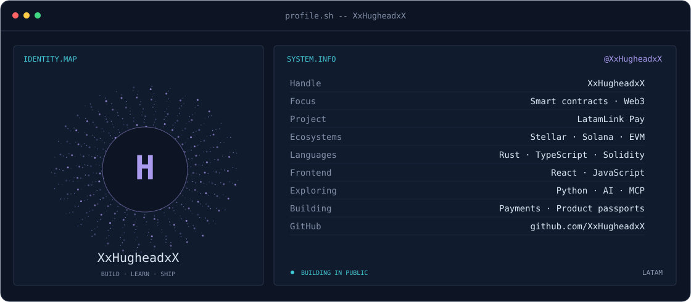
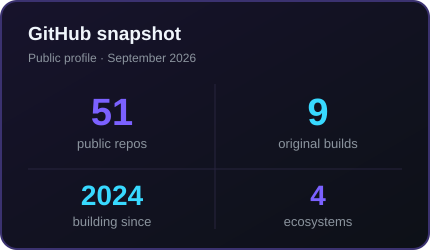
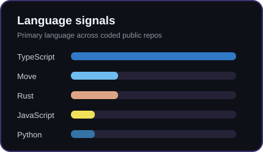

<picture>
  <source media="(prefers-color-scheme: dark)" srcset="banner-dark.svg">
  <source media="(prefers-color-scheme: light)" srcset="banner-light.svg">
  
</picture>

 

 

&nbsp;

---

## Este soy yo :)

Hola, soy **William**, desarrollador Web3 enfocado en convertir ideas complejas en productos claros, accesibles y verificables.

- 🌎 Construyo soluciones pensadas para problemas reales de **Latinoamérica**.
- 🔗 Trabajo con **contratos inteligentes, pagos, tokenización y trazabilidad on-chain**.
- ⭐ Desarrollo sobre **Stellar/Soroban**, **Solana/Anchor** y redes **EVM**.
- 🤖 Exploro la intersección entre **blockchain, agentes de IA y automatización con MCP**.
- 🏦 Actualmente formo parte de **Mercantil Santa Cruz**.
- 🚀 Mi objetivo: crear tecnología que la gente pueda usar sin tener que entender toda la complejidad que existe detrás.
- 💬 Háblame de **Web3 en LATAM, fintech o infraestructura blockchain** y tendrás toda mi atención.

 

## Mi stack ideal

 

`Stellar` · `Soroban` · `Solana` · `Anchor` · `Move` · `WebAssembly` · `MCP`

---

## Lo que estoy construyendo

<table>
<tr>
<td width="33%" valign="top">

### 🛂 [Passport LATAM](https://github.com/XxHugheadxX/Passport-latam)

Pasaportes digitales de producto en Stellar para verificar origen, materiales, certificaciones y trazabilidad.

`Stellar` `Soroban` `TypeScript`

</td>
<td width="33%" valign="top">

### 💳 [LatamLink Pay](https://github.com/XxHugheadxX/LATAMLINKPAY)

Protocolo POS descentralizado en Solana con comisiones y distribución atómica entre múltiples billeteras.

`Solana` `Anchor` `Rust`

</td>
<td width="33%" valign="top">

### 🚗 [Smart Transport](https://github.com/XxHugheadxX/contract-transport)

Pagos NFC, gestión de transporte y recompensas basadas en viajes sobre Stellar.

`Soroban` `Rust` `React`

</td>
</tr>
</table>

---

## Señales

<table>
<tr>
<td width="50%" align="center" valign="middle">

<picture>
  <source media="(prefers-color-scheme: dark)" srcset="stats-dark.svg">
  <source media="(prefers-color-scheme: light)" srcset="stats-light.svg">
  
</picture>

</td>
<td width="50%" align="center" valign="middle">

<picture>
  <source media="(prefers-color-scheme: dark)" srcset="languages-dark.svg">
  <source media="(prefers-color-scheme: light)" srcset="languages-light.svg">
  
</picture>

</td>
</tr>
</table>

---

### Construyamos algo que importe

Estoy abierto a colaborar en proyectos de **blockchain, fintech, inteligencia artificial e infraestructura open source**.

<code>Build for people · Verify everything · Keep shipping</code>

