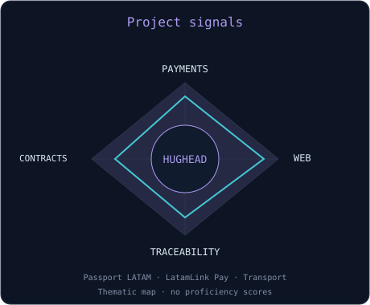
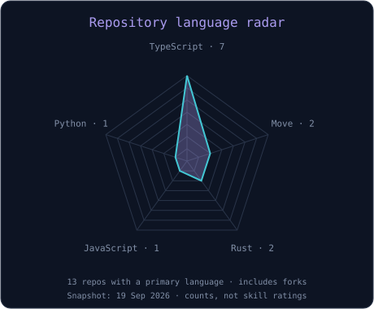

<picture>
  <source media="(prefers-color-scheme: dark)" srcset="banner-dark.svg?v=3">
  <source media="(prefers-color-scheme: light)" srcset="banner-light.svg?v=3">
  
</picture>

 

 

---

## Este soy yo :)

Soy **XxHugheadxX**. Desarrollo proyectos Web3 con foco en pagos, contratos inteligentes y trazabilidad para Latinoamérica.

- 💳 **LatamLink Pay:** pagos POS y distribución de fondos sobre Solana, con Rust y Anchor.
- 🛂 **Passport LATAM:** proyecto de equipo para pasaportes digitales de producto y trazabilidad sobre Stellar.
- ⭐ **Stellar / Soroban:** contratos y aplicaciones para pagos de transporte y recompensas.
- 🧩 **EVM / Solidity:** proyectos de aprendizaje sobre subastas y pools de liquidez.
- 🤖 Exploro herramientas de **IA y MCP**, junto con el desarrollo blockchain.

 

## Mi stack

 

<code>Stellar · Soroban · Solana · Anchor · EVM</code>

---

## signals

<table>
<tr>
<td width="50%" align="center">
<picture>
  <source media="(prefers-color-scheme: dark)" srcset="focus-dark.svg">
  <source media="(prefers-color-scheme: light)" srcset="focus-light.svg">
  
</picture>
</td>
<td width="50%" align="center">
<picture>
  <source media="(prefers-color-scheme: dark)" srcset="radar-dark.svg">
  <source media="(prefers-color-scheme: light)" srcset="radar-light.svg">
  
</picture>
</td>
</tr>
</table>

El radar cuenta repositorios públicos con lenguaje identificado en la consulta del 19 de septiembre de 2026; incluye forks. No mide dominio técnico.

---

## Proyectos para explorar

| Proyecto | Qué construimos | Ecosistema |
| :--- | :--- | :--- |
| [Passport LATAM](https://github.com/XxHugheadxX/Passport-latam) | Pasaportes digitales de producto y trazabilidad on-chain. | Stellar / Soroban |
| [LatamLink Pay](https://github.com/XxHugheadxX/LATAMLINKPAY) | Pagos POS con distribución atómica entre billeteras. | Solana / Anchor |
| [Contrato de Transporte](https://github.com/XxHugheadxX/contract-transport) | Pagos de viajes y recompensas con una interfaz React. | Stellar / Soroban |

---

[Explora mis repositorios](https://github.com/XxHugheadxX?tab=repositories) · [Visita mi portfolio](https://william-web3-portfolio.vercel.app/)

<code>Build · Learn · Ship — @XxHugheadxX</code>

Diseño inspirado en [emmi-lili/emmi-lili](https://github.com/emmi-lili/emmi-lili). Gráficos propios adaptados a mis proyectos.

